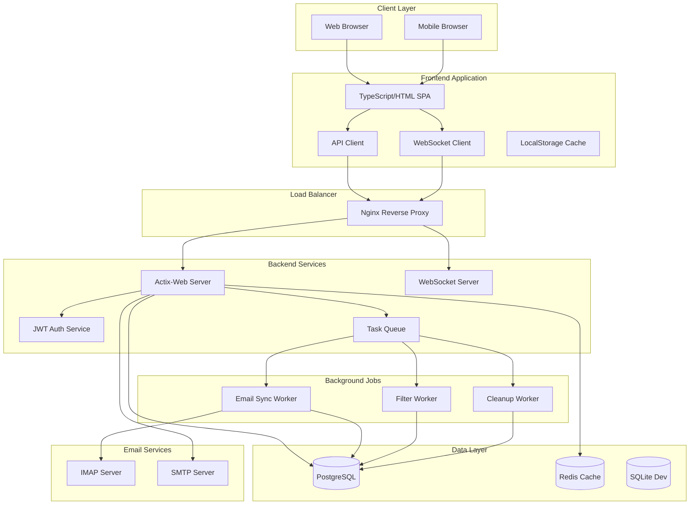
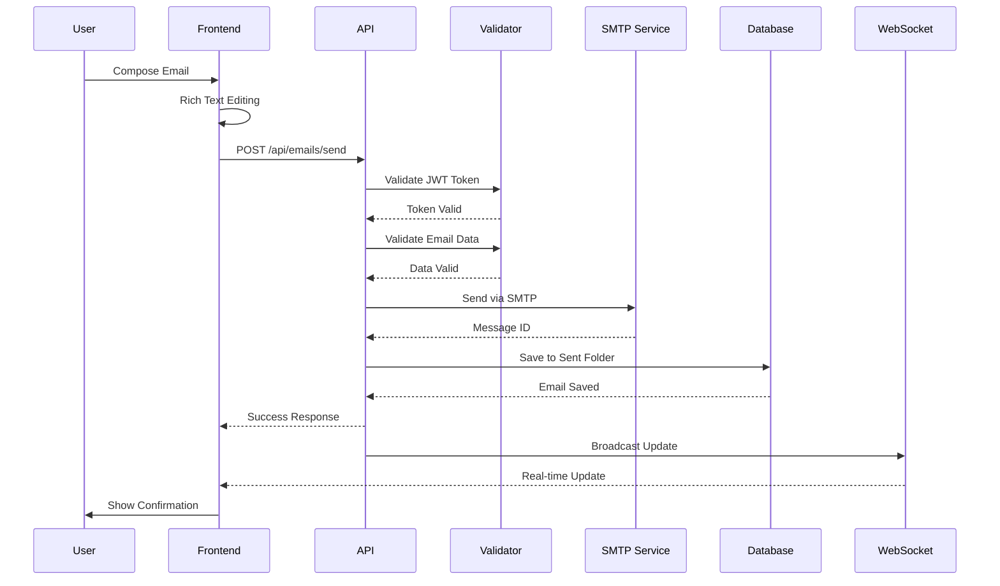
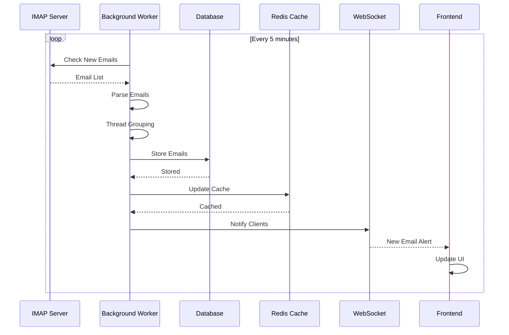
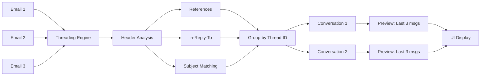
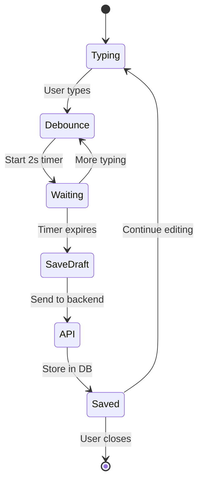
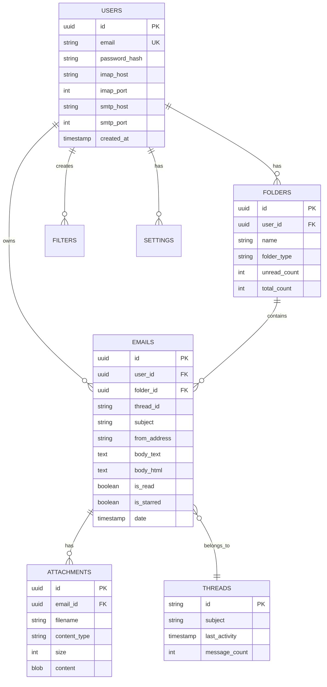
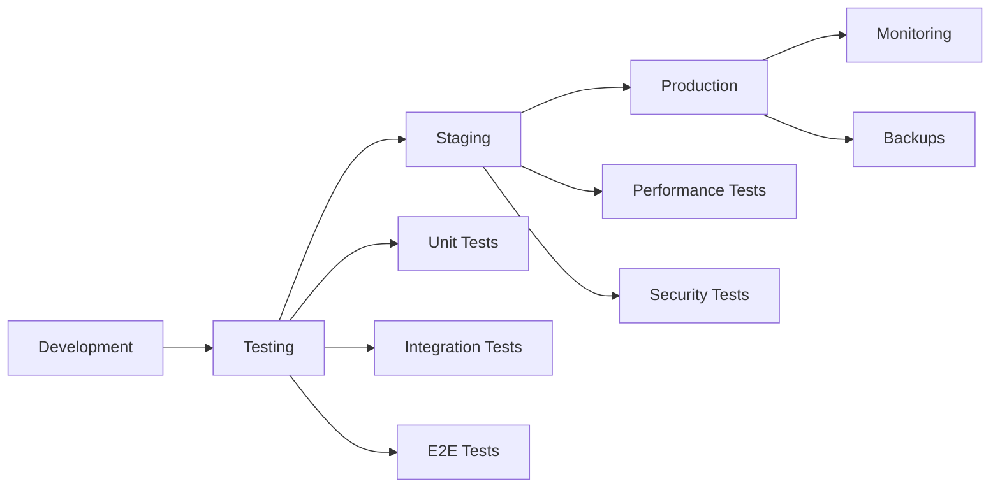

# Frame Email Client - System Architecture & Data Flow

## System Architecture Diagram



## Data Flow Diagrams

### 1. Email Sending Flow



### 2. Email Receiving Flow



### 3. Conversation Threading Flow



### 4. Auto-Save Draft Flow



## Component Architecture

### Backend Components

```
┌─────────────────────────────────────────────────────────┐
│                    Actix-Web Server                      │
├─────────────────────────────────────────────────────────┤
│  ┌──────────────┐  ┌──────────────┐  ┌──────────────┐  │
│  │   Handlers   │  │  Middleware  │  │   Services   │  │
│  ├──────────────┤  ├──────────────┤  ├──────────────┤  │
│  │ • auth       │  │ • JWT Auth   │  │ • Email      │  │
│  │ • emails     │  │ • Rate Limit │  │ • IMAP       │  │
│  │ • folders    │  │ • CORS       │  │ • SMTP       │  │
│  │ • drafts     │  │ • Logger     │  │ • Cache      │  │
│  │ • search     │  │ • CSRF       │  │ • Background │  │
│  └──────────────┘  └──────────────┘  └──────────────┘  │
├─────────────────────────────────────────────────────────┤
│                     Data Layer                           │
│  ┌──────────────┐  ┌──────────────┐  ┌──────────────┐  │
│  │  PostgreSQL  │  │    Redis     │  │   SQLite     │  │
│  │  (Production)│  │   (Cache)    │  │    (Dev)     │  │
│  └──────────────┘  └──────────────┘  └──────────────┘  │
└─────────────────────────────────────────────────────────┘
```

### Frontend Components

```
┌─────────────────────────────────────────────────────────┐
│                  TypeScript Application                  │
├─────────────────────────────────────────────────────────┤
│  ┌──────────────┐  ┌──────────────┐  ┌──────────────┐  │
│  │     Views    │  │  Components  │  │   Services   │  │
│  ├──────────────┤  ├──────────────┤  ├──────────────┤  │
│  │ • Login      │  │ • RichEditor │  │ • API Client │  │
│  │ • Inbox      │  │ • Thread     │  │ • WebSocket  │  │
│  │ • Compose    │  │ • Message    │  │ • Storage    │  │
│  │ • Settings   │  │ • Sidebar    │  │ • Auth       │  │
│  └──────────────┘  └──────────────┘  └──────────────┘  │
├─────────────────────────────────────────────────────────┤
│                    State Management                      │
│  ┌──────────────┐  ┌──────────────┐  ┌──────────────┐  │
│  │   User State │  │  Email State │  │   UI State   │  │
│  └──────────────┘  └──────────────┘  └──────────────┘  │
└─────────────────────────────────────────────────────────┘
```

## Database Schema



## API Request/Response Flow

### Authentication Flow
```
1. User Login
   POST /api/auth/login
   ├── Validate credentials
   ├── Generate JWT token
   ├── Create session
   └── Return token + user info

2. Authenticated Request
   GET /api/conversations
   ├── Extract JWT from header
   ├── Validate token
   ├── Check rate limit
   ├── Process request
   └── Return data

3. Token Refresh
   POST /api/auth/refresh
   ├── Validate refresh token
   ├── Generate new access token
   └── Return new token
```

### Email Operations Flow
```
1. Send Email
   POST /api/emails/send
   ├── Validate recipients
   ├── Process attachments
   ├── Send via SMTP
   ├── Store in Sent folder
   └── Broadcast via WebSocket

2. Reply to Email
   POST /api/emails/{id}/reply
   ├── Fetch original email
   ├── Build reply headers
   ├── Send via SMTP
   ├── Update thread
   └── Notify participants

3. Mark as Read
   PUT /api/emails/{id}/read
   ├── Update database
   ├── Update folder counts
   ├── Invalidate cache
   └── Send WebSocket update
```

## Performance Optimization Strategy

### Caching Layers
```
1. Browser Cache
   ├── Static assets (1 year)
   ├── API responses (5 minutes)
   └── User preferences (persistent)

2. Redis Cache
   ├── Conversation lists (5 minutes)
   ├── Folder counts (30 seconds)
   ├── User sessions (24 hours)
   └── Search results (10 minutes)

3. Database Query Cache
   ├── Prepared statements
   ├── Connection pooling
   └── Index optimization
```

### Load Distribution
```
1. Horizontal Scaling
   ├── Multiple backend instances
   ├── Load balancer (Nginx)
   ├── Sticky sessions for WebSocket
   └── Shared Redis cache

2. Background Processing
   ├── Email sync queue
   ├── Filter processing queue
   ├── Attachment processing
   └── Cleanup tasks
```

## Security Architecture

### Defense in Depth
```
1. Network Layer
   ├── HTTPS only
   ├── Firewall rules
   ├── DDoS protection
   └── Rate limiting

2. Application Layer
   ├── JWT authentication
   ├── CSRF tokens
   ├── Input validation
   └── SQL injection prevention

3. Data Layer
   ├── Encryption at rest
   ├── Encrypted credentials
   ├── Secure backups
   └── Audit logging
```

## Monitoring & Observability

### Metrics Collection
```
1. Application Metrics
   ├── Request rate
   ├── Response time
   ├── Error rate
   └── Active users

2. System Metrics
   ├── CPU usage
   ├── Memory usage
   ├── Disk I/O
   └── Network traffic

3. Business Metrics
   ├── Emails sent/received
   ├── User engagement
   ├── Search queries
   └── Feature usage
```

### Logging Strategy
```
1. Application Logs
   ├── Error logs
   ├── Access logs
   ├── Audit logs
   └── Debug logs

2. Log Aggregation
   ├── Centralized logging (Loki)
   ├── Log parsing
   ├── Alert rules
   └── Retention policy
```

## Deployment Pipeline



## Disaster Recovery

### Backup Strategy
```
1. Database Backups
   ├── Daily full backup
   ├── Hourly incremental
   ├── Off-site storage
   └── 30-day retention

2. Recovery Procedures
   ├── RTO: 1 hour
   ├── RPO: 1 hour
   ├── Automated restore
   └── Failover testing
```

---

This architecture ensures scalability, reliability, and performance while meeting all specified requirements for the Frame Email Client.